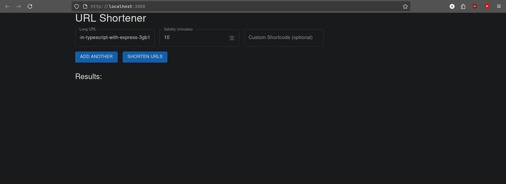

# 🔗 URL Shortener Microservice


A full-stack URL Shortener application built using **Node.js**, **Express**, **React**, and **Material UI**, with robust logging via a custom reusable **Logging Middleware**.

---

## 🚀 Features

- ✅ Shorten long URLs with optional custom shortcodes
- ⏳ Set expiration time for shortened links (default: 30 minutes)
- 📈 Track usage analytics (clicks, referrer, location)
- 📦 In-memory storage (easy swap with DB)
- 🔐 Unique shortcodes with collision handling
- 🪵 Centralized logging to external evaluation server
- 🧪 Built with clean, modular code and full error handling

---

## 🧱 Tech Stack

| Layer     | Technology               |
|---------- |--------------------------|
| Frontend  | React, Material UI (MUI) |
| Backend   | Node.js, Express         |
| Logging   | Axios-based reusable middleware |
| Storage   | JavaScript `Map()` (for demo/test) |
| Geo IP    | `geoip-lite`             |

---

## 📁 Project Structure

```

.
├── backend/
│   ├── controllers/
│   ├── routes/
│   ├── services/
│   ├── db.js
│   └── index.js
├── frontend/
│   ├── src/
│   │   ├── pages/
│   │   ├── components/
│   │   ├── utils/
│   │   └── App.js
├── logging-middleware/
│   └── index.js
└── README.md


---

## 🔧 Setup Instructions

### 🖥️ 1. Clone the Repository

```bash
git clone <your-repo-url>
cd <repo-root-folder>
````

### 📦 2. Install Dependencies

#### Backend

```bash
cd backend
npm install
```

#### Frontend

```bash
cd frontend
npm install
```

#### Logging Middleware

Place `logging-middleware/index.js` and import using:

```js
const Log = require('path-to-logging-middleware');
```

### ▶️ 3. Run the Project

#### Start Backend (Port 5000)

```bash
cd backend
node index.js
```

#### Start Frontend (Port 3000)

```bash
cd frontend
npm start
```

---

## ✉️ API Endpoints

### POST `/shorturls`

Create a short URL.

```json
{
  "url": "https://example.com",
  "validity": 45,
  "shortcode": "custom123"
}
```

**Response**

```json
{
  "shortLink": "http://localhost:5000/custom123",
  "expiry": "2025-01-01T10:00:00Z"
}
```

---

### GET `/shorturls/:shortcode`

Returns analytics and metadata for the short URL.

---

### GET `/:shortcode`

Redirects to the original long URL if still valid.

---

## 🪵 Logging Middleware

All major events and errors are logged to:

```http
POST http://20.244.56.144/evaluation-service/logs
```

#### Example Usage

```js
await Log("backend", "error", "handler", "Shortcode already exists");
await Log("frontend", "info", "component", "User submitted valid URL");
```

---

## 📦 Assumptions

* No authentication required
* Access token for logging is injected via `Authorization: Bearer <token>`
* In-memory data for testing only

---

## ✍️ Author

* **Roll No:** 00976803122

---
